<div align="center">




</div>

---

##  About Me

```yaml
name        : Vivek Kumar
education   : B.Tech - Computer Science & Engineering
institution : Sagar Group of Institutions - SISTec, Bhopal
location    : Bhopal, Madhya Pradesh, India
email       : vk9213587@gmail.com
github      : webdev-vivek
focus_areas :
  - Full-Stack Web Development
  - Data Structures & Algorithms with Java
  - AI-Powered Systems
  - Backend API Architecture
currently   : Building projects, sharpening DSA, and exploring cloud tech
open_to     : Internships, collaborations, and open-source learning
```

---

## &#127760; Connect With Me

<div align="center">

[](https://www.linkedin.com/in/vivek-kumar-125a44333)
[](mailto:vk9213587@gmail.com)
[](https://github.com/webdev-vivek)

</div>

---

## &#128736; Tech Stack & Tools

<div align="center">

**Languages**


**Frontend**


**Backend & Frameworks**


**Databases**


**Dev Tools & Platforms**


**Core Concepts**


</div>

---

## &#128640; Featured Project

<div align="center">

### Assign.AI - Smart Project Task Distribution System

</div>

> An AI-powered platform that automates task allocation across teams based on employee skills, workload, and availability.

<table>
  <tr>
    <td valign="top" width="50%">

**Key Features**

- Secure JWT-based authentication
- AI-assisted task allocation engine
- Role-based dashboards for Admin, Manager, and Employee
- Complete project and task tracking workflow
- RESTful API backend architecture
    </td>
    <td valign="top" width="50%">

**Tech Stack**

| Layer | Technology |
| --- | --- |
| Backend | Flask, Python |
| Database | MongoDB |
| Frontend | JavaScript, HTML, CSS |
| Auth | JWT |
| Architecture | REST API |

    
  </tr>
</table>

---

## &#127942; Achievements & Certifications

| Achievement | Details |
| --- | --- |
| AI System Builder | Developed Assign.AI, an end-to-end AI-powered task distribution platform |
| Java Project | Built a Library Management System with MySQL integration |
| Java Certification | Certified by Infosys Springboard |
| Google Cloud | Completed Arcade Game Labs covering Compute Engine, Cloud Shell, and cloud infrastructure |
| Competition Winner | Winner of the Prolific Engineers event |

---

## &#128202; GitHub Statistics

<div align="center">


<br/><br/>


</div>

---

## &#128200; Contribution Graph

<div align="center">

[](https://github.com/webdev-vivek)

</div>

---

## &#128064; Profile Insights

<div align="center">


</div>

---

## &#128161; Philosophy

<div align="center">

> *"Motivated to build efficient, scalable software solutions while continuously improving problem-solving, full-stack development, and cloud technology skills."*

</div>

---

<div align="center">


**If you find my work interesting, consider starring my repositories!**

*Thanks for visiting - let's build something great together.*

</div>
